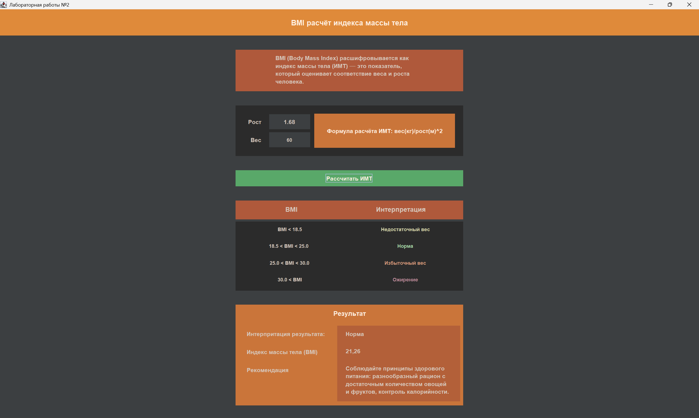

# Лабораторная работа №2 по программированию на языках высокого уровня
## Решение простых вычислительных задач на Java, Компоненты пользовательского интерфейса Swing. Формирование и компановка Gui. Делегирование обрабьотки событий.
___
### Разработка программы с графическим интерфейсом GUI для вычисления и расшифровки индекса массы тела человека BMI.
---
### Для работы программы необходимо:
- **openjdk-26**
- **Windows 10 (Windows 11)**
---
### Скриншот окна приложениея с пользовательским интерфейсом

